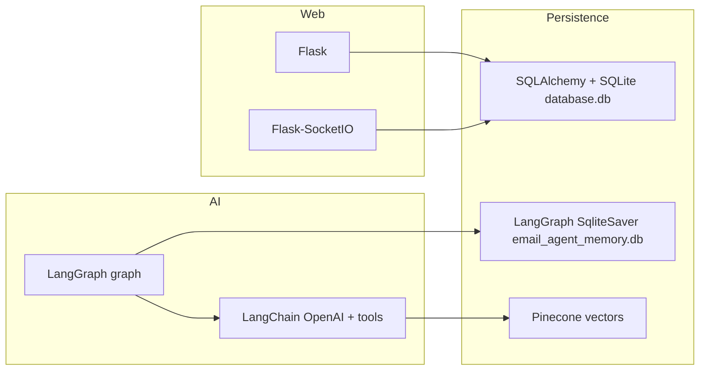

# Frameworks, libraries, and persistence

This document lists major **frameworks and libraries** used by the email-automation-ai application, **where they appear in the codebase**, and how **persistence** is implemented.

---

## Web stack

| Piece | Role | Where it is used |
|--------|------|------------------|
| **Flask** | HTTP app, blueprints | `app.py` (before/after request logging), `src/site/__init__.py` (`create_app`, blueprints), all routers under `src/site/routers/` (`auth`, `campaign`, `lead`, `prompt`, `api_key`, `webhook`) |
| **Werkzeug** (Flask dependency) | Password hashing | `src/site/routers/auth.py` (`generate_password_hash`, `check_password_hash`) |
| **Flask-SocketIO** + **python-socketio** | WebSockets / real-time | `src/site/socket.py` (`SocketIO`), `src/site/__init__.py` (`socketio.init_app`), `wsgi.py`, `app.py` (`socketio.run`), `src/site/routers/webhook.py` (`@socketio.on`, emits) |

---

## Scheduling and workers

| Piece | Role | Where it is used |
|--------|------|------------------|
| **APScheduler** (`BlockingScheduler`) | Timed jobs (campaigns, follow-ups, etc.) | `main.py` |

---

## AI / LLM stack

| Piece | Role | Where it is used |
|--------|------|------------------|
| **LangGraph** | Stateful graph for the reply agent | `src/ai/graph/reply_agent_graph.py` (`StateGraph`, `START`/`END`, `ToolNode`, conditional edges) |
| **langgraph-checkpoint-sqlite** | Persist graph runs / checkpoints | `src/ai/graph/reply_agent_graph.py` (`SqliteSaver`, SQLite file `src/database/email_agent_memory.db`) |
| **LangChain Core** | Messages, tools | `src/ai/nodes/route_nodes.py`, `response_nodes.py`, `src/ai/state/states.py`, `src/ai/tools/calendly_tools.py` (`@tool`) |
| **langchain-openai** | Chat + embeddings | `src/ai/LLMs/openai_llm.py` (`ChatOpenAI`), `src/ai/embeddings/embeddings.py` (`OpenAIEmbeddings`) |
| **langchain-pinecone** + **pinecone** | Vector store for RAG | `src/ai/tools/vector_retrievers.py` (`Pinecone`, `PineconeVectorStore`, `create_retriever_tool`) |
| **Pydantic** | Typed graph / agent state | `src/ai/state/states.py` (`BaseModel`, `Field`) |

Also declared in `requirements.txt` but not imported directly in application code (may be transitive or reserved): **langchain**, **langchain-community**, **langchain-text-splitters**.

---

## Data persistence

### 1. Primary app database (SQLAlchemy + SQLite)

| Piece | Role | Where it is used |
|--------|------|------------------|
| **SQLAlchemy** | Engine, sessions, ORM models | `src/database/session.py` (`create_engine`, `sessionmaker`, `get_session`), `src/database/base.py` (`declarative_base`), all models under `src/database/models/`, services under `src/database/services/` |
| **SQLite file** | Default store | `DATABASE_URL` defaults to `sqlite:///src/database/database.db` in `src/database/session.py`; used for campaigns, leads, users, credentials, prompts, notifications |
| **Alembic** | Schema migrations | `alembic/env.py`, `alembic/versions/*.py` |

`main.py` and HTTP routers call service-layer functions that use `get_session()` — the main transactional persistence path.

### 2. Reply-agent graph memory (separate SQLite)

| Piece | Role | Where it is used |
|--------|------|------------------|
| **sqlite3** + **SqliteSaver** | LangGraph checkpoint / thread memory | `src/ai/graph/reply_agent_graph.py` — `sqlite3.connect("src/database/email_agent_memory.db", ...)` and `SqliteSaver(conn)` |

There are **two SQLite databases**: `database.db` (app ORM) and `email_agent_memory.db` (LangGraph checkpoints).

### 3. Vector persistence (cloud)

| Piece | Role | Where it is used |
|--------|------|------------------|
| **Pinecone** | Long-term vector index for retrieval | `src/ai/tools/vector_retrievers.py` |

### 4. Auxiliary serialization

| Piece | Role | Where it is used |
|--------|------|------------------|
| **pickle** | Serialization in tools | `src/ai/tools/calendly_tools.py` |

---

## Scraping, email integrations, HTTP

| Piece | Role | Where it is used |
|--------|------|------------------|
| **requests** | HTTP to external APIs | `src/scrapers/linkedin_scraper.py`, `src/email/emails_manager.py`, `lead_manager.py`, `campaign_manager.py`, `accounts_manager.py`, `src/site/routers/webhook.py`, `src/ai/tools/calendly_tools.py` |
| **Beautiful Soup** (`bs4` package on PyPI) | HTML parsing | `src/email/emails_manager.py`, `src/scrapers/website_scraper.py` |
| **Crawl4AI** | Async crawling | `src/scrapers/website_scraper.py` (`AsyncWebCrawler`, `CrawlerRunConfig`) |
| **lxml** | Declared in `requirements.txt`; often a dependency of BS4/Crawl4AI — no direct `import lxml` in app sources |

---

## Auth, config, documents, terminal UX

| Piece | Role | Where it is used |
|--------|------|------------------|
| **PyJWT** (`jwt`) | JWT tokens | `src/site/routers/auth.py` |
| **python-dotenv** | Load `.env` | `src/site/__init__.py` (`load_dotenv`) |
| **python-docx** | Read `.docx` prompts | `src/site/routers/prompt.py`, `src/ai/prompts/user_prompts.py` |
| **colorama** | Colored console logs | `app.py` |

---

## Declared in requirements but not clearly used in `.py` sources

These did not show up under typical import patterns in the application tree:

- **google-api-python-client**
- **tldextract**
- **ipython**

They may be optional, legacy, or used outside the main app (notebooks, scripts).

---

## Architecture diagram (persistence + web + AI)

---

## Source of truth for versions

Package versions are pinned in `requirements.txt` at the repository root.
